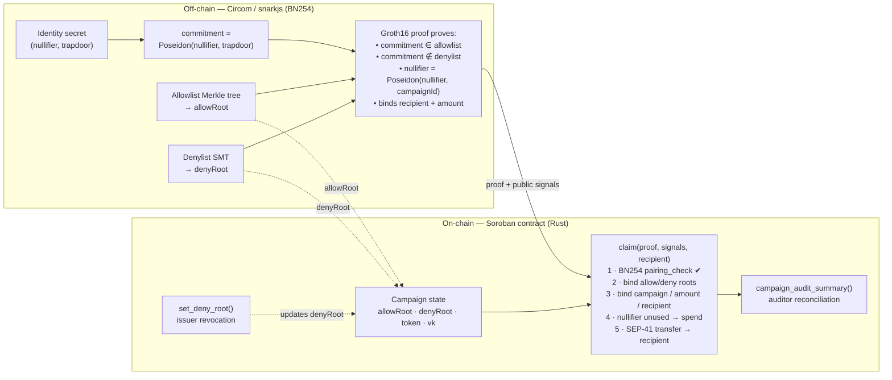

# ProofDrop — compliance-ready private disbursement rails for Stellar

**Stellar Hacks: Real-World ZK submission.**

*ProofDrop lets regulated organizations privately pay approved recipients on
Stellar. One ZK proof proves eligibility, one-claim uniqueness, recipient binding,
and denylist status; Soroban verifies it on-chain and releases the payout —
without revealing **which member of the issuer's eligibility set** is claiming.
A privacy + compliance layer for the
[Stellar Disbursement Platform](https://developers.stellar.org/docs/platforms/stellar-disbursement-platform)
audience.*

---

### 👀 60-second skim (for judges)

**What it is:** **private disbursement rails for regulated organizations** on
Stellar. An NGO, employer, or grant program makes **SEP-41 payouts (stablecoin-ready,
demoed with native XLM) only to approved recipients** — blocking double-claims,
redirected/front-run payouts, and
**revoked (sanctioned) recipients** — while **never revealing which eligibility-set
member is claiming** (the recipient address and amount are public, as in any
payment). It's the [Stellar Disbursement Platform](https://developers.stellar.org/docs/platforms/stellar-disbursement-platform)
pattern with a zero-knowledge privacy + compliance layer.

**One ZK proof, verified on-chain, does all four:**

| Outcome | How (zero-knowledge) | On-chain |
|---|---|---|
| ✅ Eligible recipient claims **privately** | proves allowlist membership, reveals no identity | paid out |
| 🔒 No double-claims | per-campaign **nullifier** | `#9 AlreadyClaimed` |
| 🛡️ No stolen / redirected payouts | proof **bound to recipient** | `#7 RecipientMismatch` |
| ⚖️ Issuer can **revoke / sanction** | **denylist non-membership** + admin deny-root | `#10 DenyRootMismatch` |
| 📊 **Auditor-ready** | on-chain totals + `claim`/`deny_set` events; `scripts/audit.sh` reconciles a campaign | eligibility identity stays unlinked |

**Why ZK is load-bearing:** without the proof, the contract could not know the
claimant is eligible, *not revoked*, and unique — **without seeing who they are**.

**See it all live in one command:** `bash scripts/deploy_testnet.sh` → deploys,
funds a campaign, performs a private claim, and shows every rejection on testnet.
Live contract + tx links: **[DEPLOYMENT.md](DEPLOYMENT.md)**.

**Compliance views:** `make dashboard` (read-only [web dashboard](web/index.html) of the
live campaign — claims, totals, reconciliation, explorer links) · `make audit`
(terminal auditor report). Both read straight from on-chain state.

---

> ### ✅ Live on Stellar testnet
> A real private claim runs on-chain right now — proof verified with Soroban's
> BN254 host functions, then paid out. Attacks and a revoked claim are all
> rejected live.
>
> - **Contract:** [`CDOHFSYP…22FI`](https://stellar.expert/explorer/testnet/contract/CDOHFSYP2V2UXQYLS6GFYXSOQMYB6FOUNQYTH7GXXPGF2KFRSE7E22FI)
> - **Private claim tx:** [`7f698d0d…`](https://stellar.expert/explorer/testnet/tx/7f698d0d1bf15e78b7ba3603684184db51dcb7efcf1e878786ec61b26c266bc3)
> - Double-claim → `#9 AlreadyClaimed` · Front-run → `#7 RecipientMismatch` · **Revoked → `#10 DenyRootMismatch`** · **Auditor report reconciles totals**
> - Full details + reproduce steps: **[DEPLOYMENT.md](DEPLOYMENT.md)**

ProofDrop is reusable infrastructure for **private, one-claim-per-person token
disbursements** on Stellar. An organization (an NGO distributing stablecoin aid,
an employer running payroll, a protocol running a grant or rewards program)
publishes the Merkle root of an **eligibility set** and funds a token budget.
Each eligible person then claims their fixed disbursement **exactly once**, to
any Stellar address — **without revealing which member of the set they are**.

The proof is generated **off-chain** with Circom/Groth16 (BN254) and **verified
on-chain inside a Soroban smart contract** using Stellar's native BN254 host
functions (Protocol 25 "X-Ray").

ProofDrop implements the **"compliant privacy"** pattern SDF calls the sweet spot
for real-world adoption — **private recipients, public policy controls**. A
campaign has two roots:

- an **allow root** — the Merkle root of the eligibility set (who's approved), and
- a **deny root** — a Sparse-Merkle root of a revocation / sanction list (an
  Association-Set-Provider–style control the issuer can update at any time).

A claim proves *membership in allow ∧ non-membership in deny*, in zero knowledge.

> Why this matters: public token distributions get farmed by bots (≈40% of the Linea
> airdrop's claimants were Sybils), naive allow-lists doxx every recipient, and
> regulated issuers need to **revoke / exclude** bad actors. ProofDrop gives
> one-claim-per-identity enforcement **with eligibility privacy and compliance
> controls** — moving real money to real people, privately.

---

## Why ZK is essential (not decoration)

Remove the proof and the product disappears:

- **Privacy** — the contract only ever sees the *roots* and a *nullifier*. It
  cannot tell which approved identity claimed; there is no on-chain link between
  a recipient and a position in the eligibility set.
- **Sybil / double-claim resistance** — a per-campaign **nullifier**
  (`Poseidon(identityNullifier, campaignId)`) rejects a second claim from the same
  identity *without knowing who they are*.
- **Eligibility without disclosure** — a Merkle membership proof shows the
  claimant was approved, revealing nothing else.
- **Compliance / revocation** — a Sparse-Merkle **non-membership** proof shows the
  claimant is *not* on the deny list. The admin revokes anyone by updating the
  deny root; revoked identities can no longer produce a valid claim.

## Architecture



Public signal order (frozen, must match contract and circuit):
`[ nullifierHash, allowRoot, denyRoot, campaignId, recipientHash, amount ]`

### Components

| Path | What it is |
|------|------------|
| [circuits/proofdrop.circom](circuits/proofdrop.circom) | allow Merkle membership + **deny SMT non-membership** + nullifier + recipient/amount binding (Poseidon, BN254) |
| [contracts/proofdrop/src/lib.rs](contracts/proofdrop/src/lib.rs) | Soroban contract: BN254 Groth16 verifier, campaign registry, **admin deny-root / revocation**, nullifier-gated claim, token payout |
| [cli/proofdrop.js](cli/proofdrop.js) | Builds allow tree + deny SMT, generates proofs, emits fixtures / testnet args (`demo` and `scenario`) |
| [cli/soroban_encode.js](cli/soroban_encode.js) | Encodes snarkjs vk/proof/signals into Soroban's BN254 byte layout |
| [scripts/build_circuit.sh](scripts/build_circuit.sh) | Compile circuit → trusted setup → export verification key |

## Run it

Prereqs: Rust + `wasm32v1-none` target, Node 18+, `circom` 2.x, `snarkjs`,
`stellar-cli`.

```bash
make demo      # build circuit, generate a proof, run the on-chain tests
# or step by step:
make circuit   # compile + Groth16 setup (BN254)
make prove     # generate a proof + write contracts/proofdrop/src/fixtures.rs
make test      # run the Soroban contract tests against the real proof
make wasm      # build the deployable contract (~12 KB)
```

### What the tests prove ([contracts/proofdrop/src/test.rs](contracts/proofdrop/src/test.rs))

- `valid_claim_pays_out` — a real Groth16 proof verifies on-chain and the
  recipient is paid.
- `double_claim_is_rejected` — the same nullifier cannot claim twice.
- `wrong_recipient_is_rejected` — a stolen proof redirected to another address
  fails (recipient binding / anti-front-running).
- `tampered_signal_is_rejected` — altering any public signal breaks verification.
- `revocation_blocks_claim` — after the admin updates the deny root, the claim fails.
- `audit_summary_reconciles` — the auditor view reports the correct claim count + total.
- `malleated_nullifier_replay_is_rejected` — see Security below.

## Security

We ran a soundness/security audit of the circuit + contract and fixed what we found:

- **Fixed (critical): non-canonical field-encoding replay.** The verifier reduces
  public signals mod *r*, but the nullifier is keyed by raw bytes — so a valid
  proof resubmitted with `nullifierHash + k·r` (same field element, different 32
  bytes) would mint a fresh nullifier key and pay out again. The contract now
  **rejects any non-canonical signal** (`NonCanonicalSignal`) before verifying,
  closing the replay. Regression test: `malleated_nullifier_replay_is_rejected`.
- **Checked & sound:** recipient/amount binding, frozen signal order across
  circuit/Rust/JS, BN254 point encoding, checks-effects-interactions (nullifier
  written before `token.transfer`), per-campaign auth on admin actions.
- **Known limitations (disclosed):** the demo deny-list SMT is 8 levels
  (demo-scale; a production deny set needs full depth); the campaign verification
  key is issuer-supplied (only risks that issuer's own funded budget); and the
  payout amount/recipient are visible at the SEP-41 transfer (recipient-level
  selective disclosure via a viewing key is a documented future step).

## Threat model & honest status

This is a hackathon MVP. What is real and what is mocked:

- ✅ **Real**: BN254 Groth16 verification on-chain via Soroban host functions;
  Merkle membership + nullifier circuit; recipient/amount binding;
  one-claim enforcement; SEP-41 token payout; deployable WASM.
- ⚠️ **Demo trusted setup** — `scripts/build_circuit.sh` runs a single local
  Powers-of-Tau + phase-2 contribution for reproducibility. A production
  deployment needs a real multi-party ceremony.
- ⚠️ **Eligibility issuance is out of scope** — "who is in the set" is the
  issuer's call (Gitcoin Passport, KYC provider, proof-of-personhood like
  Humanity Protocol, event attendance, prior on-chain activity). ProofDrop
  proves *membership privately*; it does not itself establish personhood. We
  call this **issuer-gated one-claim eligibility**, not universal proof-of-human.
- ⚠️ Allow tree depth is 16 (65 536 members); the demo deny SMT depth is 8. Both trivially
  parameterizable.

## Credits & originality

Built during Stellar Hacks: Real-World ZK (June 2026). **Original work:** the
ProofDrop circuit (allowlist Merkle membership + denylist SMT non-membership +
nullifier + recipient/amount binding), the Soroban contract (campaign registry,
nullifier store, admin revocation, auditor views, and the BN254 Groth16 verifier
adapted from BLS12-381 to BN254), the proving/encoding CLI, the dashboard, and the
scripts. **Standard dependencies (not our code):** [circomlib](https://github.com/iden3/circomlib)
(Poseidon, `SMTVerifier`), [snarkjs](https://github.com/iden3/snarkjs), the Soroban
Rust SDK, and `@stellar/stellar-sdk`. The on-chain verifier structure is adapted from
Stellar's [`soroban-examples/groth16_verifier`](https://github.com/stellar/soroban-examples/tree/main/groth16_verifier)
(the BN254 port + serialization + all application logic are ours). MIT licensed (see [LICENSE](LICENSE)).

## Cryptographic notes

- Curve **BN254** end-to-end: Circom/circomlib Poseidon and the snarkjs
  toolchain are BN254-native, and Soroban exposes BN254 pairing host functions
  (Protocol 25). Point encoding follows the **Ethereum/EVM convention**
  (`Fp` big-endian; `Fp2` = `c1‖c0`; G1 = `X‖Y`; G2 = `X.c1‖X.c0‖Y.c1‖Y.c0`),
  verified against `soroban-env-host`'s decoder.
- Recipient binding: the contract derives `Fr(sha256(recipient.to_xdr(env)))`
  and checks it equals the proof's `recipientHash`. The off-chain side
  reproduces the exact `ScVal(Address)` XDR, so a proof is cryptographically
  tied to its recipient and amount and cannot be front-run.
