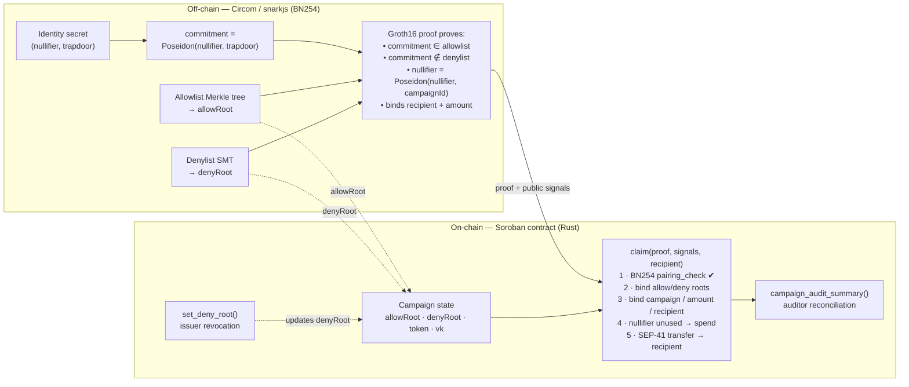

# ProofDrop

Private, compliance-aware token disbursement on Stellar. A regulated issuer
funds a campaign and pays approved recipients; each recipient proves eligibility
with a single zero-knowledge proof that a Soroban contract verifies on-chain
before releasing the payout — without revealing which member of the eligibility
set is claiming.

Built for [Stellar Hacks: Real-World ZK](https://dorahacks.io/hackathon/stellar-hacks-zk).
It sits next to the [Stellar Disbursement Platform](https://developers.stellar.org/docs/platforms/stellar-disbursement-platform)
as a privacy and compliance layer.

## What it does

An NGO, employer, or grant program publishes the Merkle root of an eligibility
set and funds a token budget. Each eligible person claims their fixed
disbursement once, to any Stellar address, by submitting one Groth16 proof. The
proof simultaneously establishes:

| Property | Mechanism | On rejection |
|---|---|---|
| Eligible recipient claims privately | allowlist Merkle membership | — |
| No double-claims | per-campaign nullifier | `#9 AlreadyClaimed` |
| No redirected / front-run payouts | proof bound to recipient | `#7 RecipientMismatch` |
| Revocation / sanctions | denylist non-membership + admin deny-root | `#10 DenyRootMismatch` |
| Auditor reconciliation | on-chain totals + `claim` / `deny_set` events | — |

The recipient address and amount are public, as in any payment. What stays
private is the link between a payout and a position in the eligibility set: the
contract sees only the roots and a nullifier, never which approved identity
claimed.

The proof is generated off-chain with Circom / Groth16 (BN254) and verified
on-chain in a Soroban contract using Stellar's native BN254 host functions
(Protocol 25).

## Live on testnet

A real private claim runs on-chain: the proof is verified with Soroban's BN254
host functions, then paid out. The double-claim, front-run, and revoked-claim
paths are all rejected live.

- Contract: [`CCHOFZBK…6AXFS`](https://stellar.expert/explorer/testnet/contract/CCHOFZBKZVBBCGSJFYPUV3Q4HPY3GOMBX2Q7H4CLP3IIBOX2W6U6AXFS)
- Private claim tx: [`0fa86207…`](https://stellar.expert/explorer/testnet/tx/0fa86207117ed0869e66af8738d4213b1c189376f2650b53e925b1a6526031e4)
- Full details and reproduce steps: [DEPLOYMENT.md](DEPLOYMENT.md)

## Why the proof is load-bearing

Remove the proof and the product does not exist. The contract has no other way
to know the claimant is eligible, not revoked, and has not already claimed —
without learning who they are.

- **Privacy** — the contract sees only the roots and a nullifier; there is no
  on-chain link between a recipient and a position in the eligibility set.
- **Sybil / double-claim resistance** — a per-campaign nullifier
  (`Poseidon(identityNullifier, campaignId)`) rejects a second claim from the
  same identity without knowing who they are.
- **Eligibility without disclosure** — a Merkle membership proof shows the
  claimant was approved and reveals nothing else.
- **Revocation** — a Sparse-Merkle non-membership proof shows the claimant is
  not on the deny list. The admin revokes anyone by updating the deny root.

Public token distributions get farmed by bots (roughly 40% of the Linea airdrop's
claimants were Sybils), naive allowlists doxx every recipient, and regulated
issuers need to exclude sanctioned actors. ProofDrop enforces one claim per
identity while keeping eligibility private and the policy controls public — the
"compliant privacy" pattern SDF describes as the adoption sweet spot.

## Architecture



Public signal order (frozen; must match contract and circuit):
`[ nullifierHash, allowRoot, denyRoot, campaignId, recipientHash, amount ]`

### Components

| Path | Description |
|------|-------------|
| [circuits/proofdrop.circom](circuits/proofdrop.circom) | Allow Merkle membership + deny SMT non-membership + nullifier + recipient/amount binding (Poseidon, BN254) |
| [contracts/proofdrop/src/lib.rs](contracts/proofdrop/src/lib.rs) | Soroban contract: BN254 Groth16 verifier, campaign registry, admin deny-root / revocation, nullifier-gated claim, token payout |
| [cli/proofdrop.js](cli/proofdrop.js) | Builds allow tree + deny SMT, generates proofs, emits fixtures / testnet args (`demo` and `scenario`) |
| [cli/soroban_encode.js](cli/soroban_encode.js) | Encodes snarkjs vk/proof/signals into Soroban's BN254 byte layout |
| [scripts/build_circuit.sh](scripts/build_circuit.sh) | Compile circuit, trusted setup, export verification key |

## Run it

Prerequisites: Rust with the `wasm32v1-none` target, Node 18+, `circom` 2.x,
`snarkjs`, `stellar-cli`.

```bash
make demo      # build circuit, generate a proof, run the on-chain tests
# or step by step:
make circuit   # compile + Groth16 setup (BN254)
make prove     # generate a proof + write contracts/proofdrop/src/fixtures.rs
make test      # run the Soroban contract tests against the real proof
make wasm      # build the deployable contract (~12 KB)
```

Compliance views: `make dashboard` builds a read-only
[web dashboard](web/index.html) of the live campaign (claims, totals,
reconciliation, explorer links); `make audit` prints the same as a terminal
report. Both read directly from on-chain state.

### Tests ([contracts/proofdrop/src/test.rs](contracts/proofdrop/src/test.rs))

- `valid_claim_pays_out` — a real Groth16 proof verifies on-chain and the
  recipient is paid.
- `double_claim_is_rejected` — the same nullifier cannot claim twice.
- `wrong_recipient_is_rejected` — a stolen proof redirected to another address
  fails (recipient binding / anti-front-running).
- `tampered_signal_is_rejected` — altering any public signal breaks verification.
- `revocation_blocks_claim` — after the admin updates the deny root, the claim
  fails.
- `audit_summary_reconciles` — the auditor view reports the correct claim count
  and total.

## Scope and status

This is a hackathon MVP. What is production-grade and what is demo-scale:

- **Real**: BN254 Groth16 verification on-chain via Soroban host functions;
  Merkle membership + nullifier circuit; recipient/amount binding; one-claim
  enforcement; SEP-41 token payout; deployable WASM; live on testnet.
- **Demo trusted setup** — `scripts/build_circuit.sh` runs a single local
  Powers-of-Tau + phase-2 contribution for reproducibility. A production
  deployment needs a real multi-party ceremony.
- **Eligibility issuance is out of scope** — who is in the set is the issuer's
  call (Gitcoin Passport, a KYC provider, proof-of-personhood, event attendance,
  prior on-chain activity). ProofDrop proves membership privately; it does not
  itself establish personhood.
- Allow tree depth is 16 (65,536 members); the demo deny SMT depth is 8. Both
  are trivially parameterizable.

## Credits and originality

Built during Stellar Hacks: Real-World ZK (June 2026). Original work: the
ProofDrop circuit (allowlist Merkle membership + denylist SMT non-membership +
nullifier + recipient/amount binding), the Soroban contract (campaign registry,
nullifier store, admin revocation, auditor views, and the BN254 Groth16 verifier
adapted from BLS12-381 to BN254), the proving/encoding CLI, the dashboard, and
the scripts. Standard dependencies (not our code):
[circomlib](https://github.com/iden3/circomlib) (Poseidon, `SMTVerifier`),
[snarkjs](https://github.com/iden3/snarkjs), the Soroban Rust SDK, and
`@stellar/stellar-sdk`. The on-chain verifier structure is adapted from Stellar's
[`soroban-examples/groth16_verifier`](https://github.com/stellar/soroban-examples/tree/main/groth16_verifier)
(the BN254 port, serialization, and all application logic are ours). MIT licensed
(see [LICENSE](LICENSE)).

## Cryptographic notes

- Curve BN254 end-to-end: Circom/circomlib Poseidon and the snarkjs toolchain are
  BN254-native, and Soroban exposes BN254 pairing host functions (Protocol 25).
  Point encoding follows the Ethereum/EVM convention (`Fp` big-endian;
  `Fp2` = `c1‖c0`; G1 = `X‖Y`; G2 = `X.c1‖X.c0‖Y.c1‖Y.c0`), verified against
  `soroban-env-host`'s decoder.
- Recipient binding: the contract derives `Fr(sha256(recipient.to_xdr(env)))` and
  checks it equals the proof's `recipientHash`. The off-chain side reproduces the
  exact `ScVal(Address)` XDR, so a proof is cryptographically tied to its
  recipient and amount and cannot be front-run.
